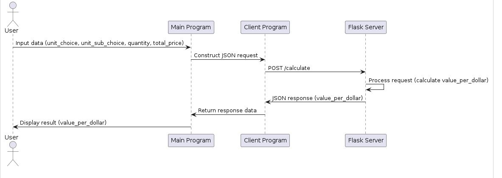

markdown
Copy code
# Calculation Service Microservice

This repository contains a Flask microservice that calculates the value per dollar for given product quantities and prices.

## Installation

1. **Clone the repository**:
   ```bash
   git clone https://github.com/yourusername/calculation-service.git
   cd calculation-service
2. **Create and activate a virtual environment**:
   
      **Windows**:
   ```
    python -m venv venv
    .\venv\Scripts\activate
   ```

   
      **MacOS/Linux**:
    ```
        python3 -m venv venv
        source venv/bin/activate
    ```
3. **Install dependencies**:

    `
    pip install -r requirements.txt
    `


## Usage
1. **Start the Flask server**:
`bash
Copy code
python calculation_service.py`

2. **Run the Test Program**:
    Ensure requests is installed:
      `bash
      pip install requests`

      
3. **Run the test script**:
    `bash
    python test_calculation_service.py`

## API Endpoints


### POST /calculate

    URL: http://127.0.0.1:5000/calculate
    Method: POST
    Headers: Content-Type: application/json
    
**Request Body**:

```
{
"unit_choice": "1",
"unit_sub_choice": "liters",
"quantity": 2.5,
"total_price": 5.0
}
```


**Response Body**:
```
{
    "status": "success",
    "quantity": 2.5,
    "unit_sub_choice": "liters",
    "total_price": 5.0,
    "value_per_dollar": 0.5
}
```


## Example Request
```
import requests

url = 'http://127.0.0.1:5000/calculate'
headers = {'Content-Type': 'application/json'}
data = {
    "unit_choice": "1",
    "unit_sub_choice": "liters",
    "quantity": 2.5,
    "total_price": 5.0
}

response = requests.post(url, json=data, headers=headers)

if response.status_code == 200:
    print("Response from calculation service:")
    print(response.json())
else:
    print("Failed to calculate data:")
    print(response.json())
```

## Example Response
The response from the /calculate endpoint will be a JSON object containing the following fields:

         status: Indicates success or error.
         quantity: The quantity of the product.
         unit_sub_choice: The unit of measurement.
         total_price: The total price of the product.
         value_per_dollar: The calculated value per dollar.
    
**Example response**:
```
{
    "status": "success",
    "quantity": 2.5,
    "unit_sub_choice": "liters",
    "total_price": 5.0,
    "value_per_dollar": 0.5
}
```

## Communication Contract
Request Data: Send a POST request to /calculate with the following JSON body:

```
{
    "unit_choice": "1",
    "unit_sub_choice": "liters",
    "quantity": 2.5,
    "total_price": 5.0
}
```

Receive Data: The microservice will respond with a JSON object:

```
{
    "status": "success",
    "quantity": 2.5,
    "unit_sub_choice": "liters",
    "total_price": 5.0,
    "value_per_dollar": 0.5
}
```

## UML Diagram 



